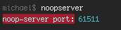

# noop-server 

> Quickly launch a noop server and get the port number.

Useful for testing.

[](https://travis-ci.org/radiovisual/noop-server)

## Install

```
$ npm install --save noop-server
```
## Usage

```js
const noopserver = require('noop-server');

noopserver().then(port => {
	console.log(port);
	//=> 61739
});
```

## CLI

## Install

```
$ npm install --global noop-server
```

Launches a [noop](https://en.wikipedia.org/wiki/NOP) server on a free port, and prints the port number to the console.

## CLI Usage
```
$ noopserver
noop-server port: 61511
```



## License

MIT © [Michael Wuergler](http://numetriclabs.com)
